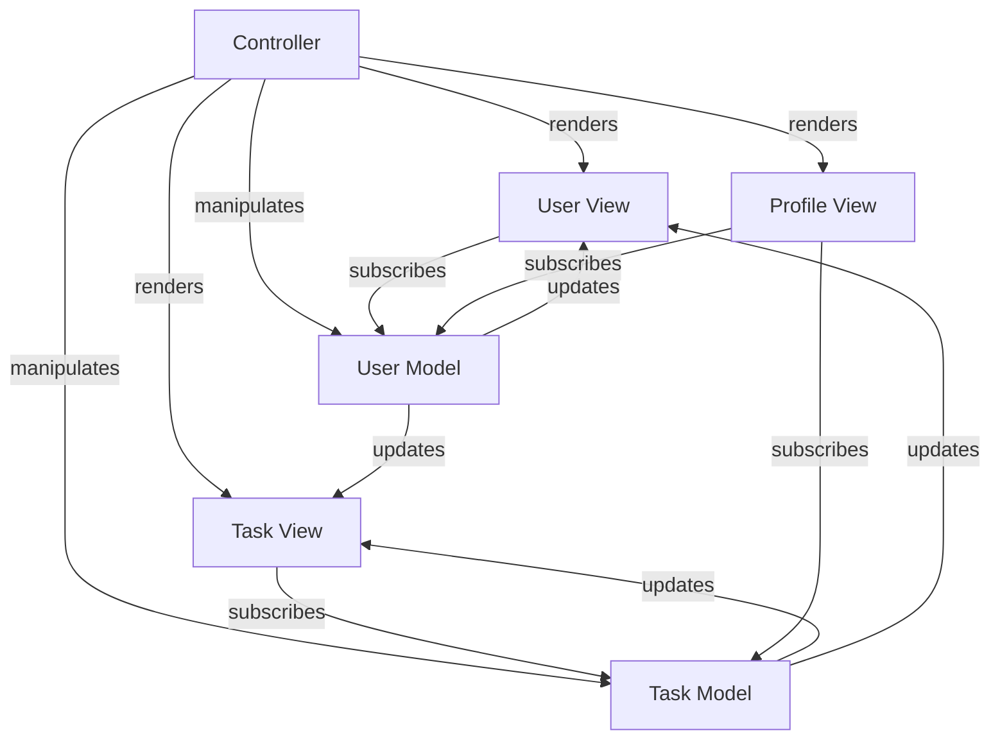
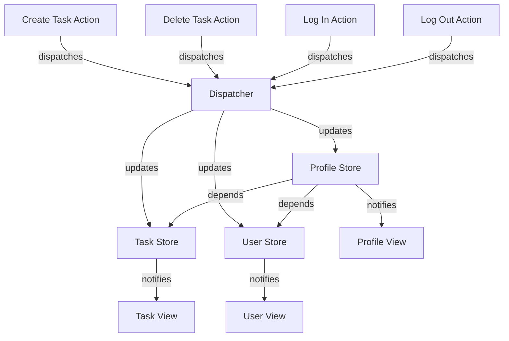
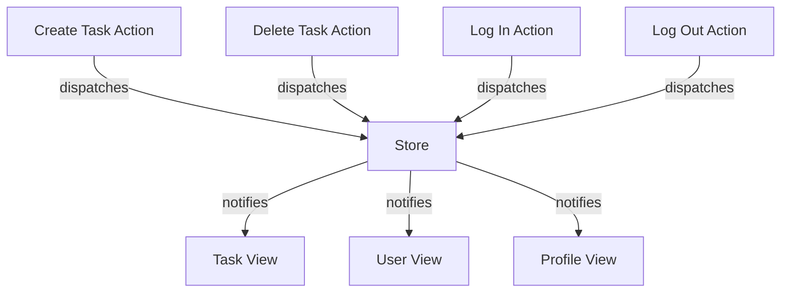

# Demystifying Redux


**In the realm of front-end development, JavaScript reigns supreme.**

As web applications evolved, their complexity burgeoned. Fragments of their state were scattered across modules like confetti after a parade. Under the guise of [MVC](https://developer.mozilla.org/en-US/docs/Glossary/MVC), application modules became tangled in a ball of yarn that not even a grandmother could handle.



> An application where managers can view all user tasks and users can view their own tasks could be designed like this.

## From Brainstorm to Breakthrough

With the rise of [React](https://react.dev/), a team at Meta - Facebook, at the time - proposed [Flux](https://facebookarchive.github.io/flux/) as a solution: application data will flow in a clear and predictable fashion; an **action** will be **dispatch**ed to update a portion of the application’s **state**, which will reside within its **store**.

Flux, though powerful, had its pitfalls. Different actions were often handled by different stores, keeping the application's state segregated. This could cause stores to be dependent on each other, giving birth to state mutation chains that were hard to read, write, debug, and test.



> The same task management application.

## The Quest For Purity

With some guidance from [Elm](https://guide.elm-lang.org/), [Dan](https://danabra.mov/) and [Andrew](https://andrewclark.io/) embarked on crafting a sleeker solution, inspired by the [CQRS](https://martinfowler.com/bliki/CQRS.html) approach of Flux. [Redux](https://redux.js.org/) had a humble beginning, starting as a library designed to address the challenges of state management in JavaScript applications.

It came to place upon us three constraints.

- No matter how simple or complex an application is, its state is represented by a single value.

  - For maximum flexibility, this is usually an object.

A single state tree that serves as the definitive source of truth for the entire application. Unlike traditional approaches where state is scattered across multiple components, all the application's state is consolidated into a centralised data structure, promoting clarity and consistency.

- The application's state is read-only.

  - Any change to the state is dispatched through an action.
  - An action is the representation of an intended change to the state.

The application's state is immutable by design. Any attempt to modify the state directly is prohibited, ensuring that all changes occur through well-defined actions. Modifying the state requires dispatching actions, which serve as explicit instructions for state updates, promoting predictability and directionality.

- State mutations are described by pure functions.

  - These are called **reducer** functions.
  - They use the application's state and the action being dispatched to produce a new application state.
  - If the action is of an unknown type, the function returns the current application's state.
  - If the current application's state is not defined, the function returns a default application state.

Pure functions describe state mutations in a deterministic and predictable manner. These functions take the current state and an action as inputs and produce a new state as an output, without ever modifying the original state. By nature of causing no side effects, they're inherently transparent, testable, and composable.



> Again, the task management application.

## Uncharted Territories

Redux evolved beyond being just a library, becoming a set of ideas that transcended language barriers. From here on out, we'll indulge in translating its principles into a different language.

> The code snippets that follow will be written in [Dart](https://dart.dev/guides); you're free to follow along using any language of your choice. If you do so, share your results! Dart was chosen for no particular reason other than it not being JavaScript.

At its core, Redux is an incredibly simple pattern. We store a value, execute a function to update that value, and notifiy any subscribers that the value may have changed.

```dart
class Store<S> {
  final S Function(S?, dynamic) reducer;
  final _listeners = List<void Function()>.empty(growable: true);
  S? _state;

  Store(
    this.reducer, {
    S? initialState,
  }) : _state = initialState;

  void dispatch(dynamic action) {
    _state = reducer(_state, action);

    for (var listener in _listeners) {
      listener();
    }
  }

  void Function() subscribe(void Function() listener) {
    _listeners.add(listener);

    return () {
      _listeners.remove(listener);
    };
  }

  S? get state {
    return _state;
  }
}
```

Let's break it down.

```dart
class Store<S>
```

A [generic class](https://dart.dev/language/generics) that manages a state of any type. This ensures that both the data managed by the store and the data received or returned by the `reducer` function have the same structure.

```dart
S? _state;
```

A reference to the current state of the store. Only the store should be able to change this reference's value.

```dart
final S Function(S?, dynamic) reducer;
```

A reference to a function that must be called with two positional arguments: the current state and an action. It is responsible for updating the state based on an action dispatched to the store.

```dart
final _listeners = List<void Function()>.empty(growable: true);
```

A reference to an empty, growable list of functions. The referenced functions will be called after an action is dispatched to the store.

```dart
Store(
  this.reducer, {
  S? initialState,
}) : _state = initialState;
```

A constructor, used to create objects of type `Store`.

```dart
void dispatch(dynamic action) {
  _state = reducer(_state, action);

  for (var listener in _listeners) {
    listener();
  }
}
```

A method that allows dispatching actions to the store. It updates the current state and notifies any subscribers of a potential change.

```dart
void Function() subscribe(void Function() listener) {
  _listeners.add(listener);

  return () {
    _listeners.remove(listener);
  };
}
```

A method that allows subscribing to the store. As a courtesy, it returns a function to unsubscribe.

## The Final Boss

Did you notice how the store does not force all the aforementioned constraints on us? Weird, huh?

Can you spot how those constraints are being respected in the following snippet? Can you [predict](https://dart.dev/language/operators) this code's output without [executing it](https://dartpad.dev/)?

```dart
enum Action {
  feed,
  play,
  sleep,
}

class Tamagotchi {
  final int hunger;
  final int happiness;
  final bool sleeping;

  Tamagotchi({
    this.hunger = 50,
    this.happiness = 50,
    this.sleeping = false,
  });

  @override
  String toString() {
    return '{ hunger: $hunger, happiness: $happiness, sleeping: $sleeping }';
  }
}

Tamagotchi reducer(Tamagotchi? state, dynamic action) {
  final value = state ?? Tamagotchi();

  if (action is! Action) {
    return value;
  }

  int asPercent(int number) {
    return number.clamp(0, 100);
  }

  switch (action) {
    case Action.feed:
      return value.sleeping
          ? value
          : Tamagotchi(
              hunger: asPercent(value.hunger - 20),
              happiness: value.happiness,
              sleeping: value.sleeping,
            );

    case Action.play:
      return value.sleeping
          ? value
          : Tamagotchi(
              hunger: value.hunger,
              happiness: asPercent(value.happiness + 20),
              sleeping: value.sleeping,
            );

    case Action.sleep:
      return Tamagotchi(
        hunger: value.hunger,
        happiness: value.happiness,
        sleeping: true,
      );

    default:
      return value;
  }
}

void main() {
  final store = Store(reducer);

  final unsubscribe = store.subscribe(() {
    print('SUBSCRIBER 01: ${store.state}');
  });

  store.subscribe(() {
    print('SUBSCRIBER 02: ${store.state}');
  });

  store.dispatch(Action.feed);
  store.dispatch(Action.feed);
  unsubscribe();
  store.dispatch(Action.feed);
  store.dispatch(Action.play);
  store.dispatch(Action.play);
  store.dispatch(Action.sleep);
  store.dispatch(Action.play);
}
```

## Epilogue

As we bid adieu, remember: Redux isn't a magic bullet for every situation. It is indeed a powerful tool, but it's essential to stay flexible and consider whether it's the right fit for your project.

Sometimes, Redux may not be enough, and you'll need to complement it with other tools. Sometimes, Redux is too much, and simpler solutions might be more suitable. That's perfectly okay!

Take whatever you might have learned, explore different approaches, and adapt as needed. Whether you're tinkering with a new command-line tool, building an exciting game, or crafting a sleek web app, let Redux be a guiding light, but not the only one.

Maybe you can [build a full-fledged Tamagotchi](https://www.members.tripod.com/~Tamagotchi_Central/instructions.html) with Redux. Maybe you can do it without it. What matters is you go forth and conquer. Can't wait to see what you'll create!
